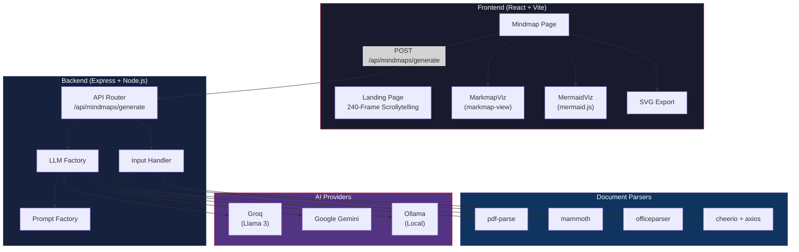
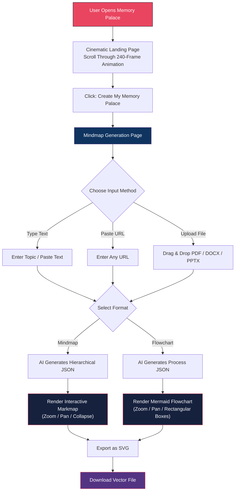

<p align="center">
  
</p>

<h1 align="center">Memory Palace</h1>

<p align="center">
  <strong>Transform any idea into a structured, visual mind map or flowchart -- instantly.</strong>
</p>

<p align="center">
  
  
  
  
  
  
  
</p>

<p align="center">
  <a href="#features">Features</a> &bull;
  <a href="#architecture">Architecture</a> &bull;
  <a href="#user-flow">User Flow</a> &bull;
  <a href="#tech-stack">Tech Stack</a> &bull;
  <a href="#getting-started">Getting Started</a> &bull;
  <a href="#api-reference">API</a>
</p>

---

## Why I Built This

When I first watched Sherlock Holmes, the thing that fascinated me the most wasn't the deductions or the crime-solving -- it was the **Memory Palace**. The way Sherlock could walk through an imaginary architectural space inside his mind, placing memories in rooms and recalling them effortlessly by simply revisiting those rooms, felt like a superpower.

That stuck with me.

I realized that mind maps are, in a way, your own kind of Memory Palace. They let you take something impossibly complex -- a 50-page research paper, an entire semester of notes, a sprawling topic you're trying to learn -- and break it down into a spatial structure you can actually *navigate*. You're not just reading linearly anymore. You're walking through your knowledge.

So I built this. Upload any document, paste any text, or just type a topic -- and Memory Palace instantly decomposes it into a richly detailed, interactive mind map or a structured flowchart that you can zoom into, pan around, explore, and export. It's the closest thing I could build to giving everyone their own Sherlock-style Memory Palace.

---

## Features

| Feature | Description |
|:--------|:------------|
| **AI-Powered Mind Maps** | Paste any text, topic, or URL. Groq or Gemini AI breaks it down into an exhaustive, deeply nested hierarchical mind map. |
| **AI-Powered Flowcharts** | Toggle to Flowchart mode for a strict top-down process diagram with rectangular boxes and directional arrows. |
| **Document Upload** | Drag and drop PDFs, DOCX, or PPTX files directly. The backend extracts all text natively and feeds it to the AI. |
| **URL Parsing** | Paste any URL. Memory Palace scrapes the page content, strips boilerplate, and generates a mind map from the extracted text. |
| **Interactive Zoom & Pan** | Both mind maps (via Markmap) and flowcharts (via Mermaid + react-zoom-pan-pinch) support full mouse-wheel zoom and click-drag panning. |
| **SVG Export** | One-click export of your generated diagram as a crisp, infinitely scalable SVG vector file. |
| **Cinematic Landing Page** | A 240-frame scrollytelling animation sequence with scroll-synced narrative overlays and premium typography. |
| **Cloud & Local AI** | Toggle between cloud LLM providers (Groq, Gemini) or a local Ollama instance with a single click. |

---

## Architecture



---

## User Flow



---

## Tech Stack

### Frontend

| Technology | Purpose |
|:-----------|:--------|
| **React 19** | UI framework with hooks-based architecture |
| **TypeScript 5.9** | End-to-end type safety |
| **Vite 8** | Ultra-fast HMR dev server and bundler |
| **Tailwind CSS 4** | Utility-first styling engine |
| **Framer Motion 12** | Physics-based scroll animations and transitions |
| **Markmap** | Interactive, zoomable mind map rendering |
| **Mermaid.js** | Flowchart and process diagram rendering |
| **react-zoom-pan-pinch** | Touch and mouse zoom/pan for flowcharts |
| **Lucide React** | Premium icon library |

### Backend

| Technology | Purpose |
|:-----------|:--------|
| **Express 5** | HTTP server and API routing |
| **Groq SDK** | Lightning-fast Llama 3 inference |
| **Google Generative AI** | Gemini model integration |
| **Ollama** | Self-hosted local LLM support |
| **Multer** | Multipart file upload handling |
| **pdf-parse** | Native PDF text extraction |
| **Mammoth** | DOCX to raw text conversion |
| **Officeparser** | PPTX and other Office format parsing |
| **Cheerio** | Server-side HTML scraping for URL inputs |

---

## Getting Started

### Prerequisites

- **Node.js** >= 20
- **npm** >= 9
- A **Groq API Key** or **Google Gemini API Key** (at least one)

### 1. Clone the Repository

```bash
git clone https://github.com/codewithadvi/MemoryPalace.git
cd MemoryPalace
```

### 2. Install Dependencies

```bash
# Backend
cd backend
npm install

# Frontend
cd ../frontend
npm install
```

### 3. Configure Environment Variables

Create a `.env` file inside the `backend/` directory:

```env
GROQ_API_KEY=your_groq_api_key_here
GEMINI_API_KEY=your_gemini_api_key_here
```

> You only need one of the two keys. The system automatically selects the best available provider.

### 4. Start Development Servers

```bash
# Terminal 1 - Backend (Port 3000)
cd backend
npm run dev

# Terminal 2 - Frontend (Port 5173)
cd frontend
npm run dev
```

### 5. Open in Browser

Navigate to **[http://localhost:5173](http://localhost:5173)** and start building your Memory Palace.

---

## API Reference

### `POST /api/mindmaps/generate`

Generate a mind map or flowchart from text, URL, or uploaded document.

#### Request (JSON Body)

```json
{
  "input": "Quantum Computing",
  "type": "text",
  "forceLocal": false,
  "format": "mindmap"
}
```

| Field | Type | Description |
|:------|:-----|:------------|
| `input` | `string` | The text content, topic, or URL |
| `type` | `"text" \| "url"` | Whether the input is raw text or a URL to scrape |
| `forceLocal` | `boolean` | Force Ollama local inference instead of cloud |
| `format` | `"mindmap" \| "flowchart"` | Output visualization format |

#### Request (File Upload - multipart/form-data)

| Field | Type | Description |
|:------|:-----|:------------|
| `file` | `File` | PDF, DOCX, or PPTX document |
| `forceLocal` | `string` | `"true"` or `"false"` |
| `format` | `string` | `"mindmap"` or `"flowchart"` |

#### Response

```json
{
  "status": "success",
  "data": {
    "id": "root",
    "topic": "Quantum Computing",
    "children": [
      {
        "id": "1",
        "topic": "Qubits",
        "children": [
          { "id": "1.1", "topic": "Superposition" },
          { "id": "1.2", "topic": "Entanglement" }
        ]
      }
    ]
  }
}
```

---

<p align="center">
  <sub>Built with obsessive attention to detail by <a href="https://github.com/codewithadvi">@codewithadvi</a></sub>
</p>
